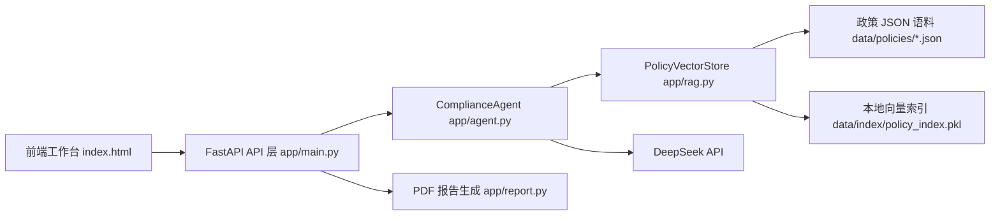
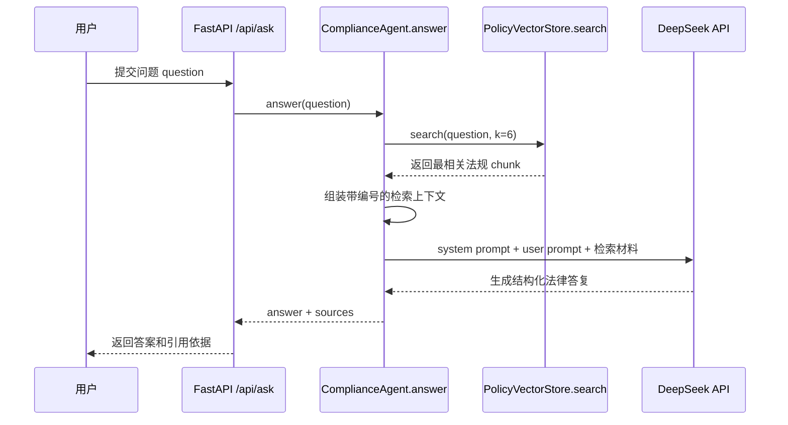
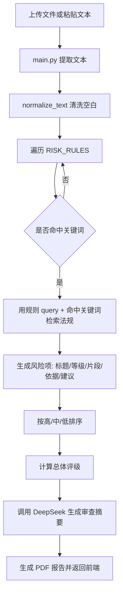
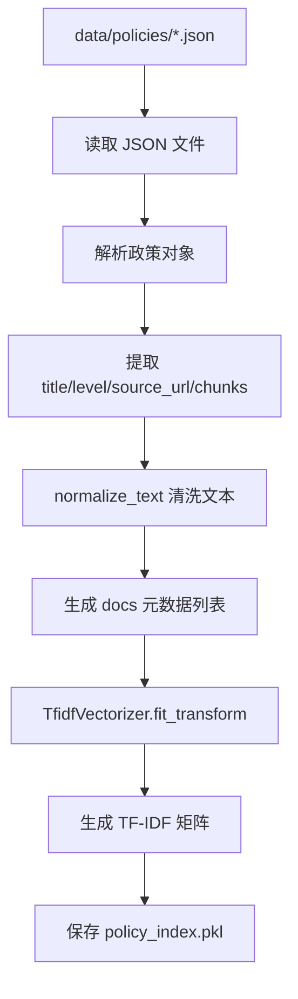

# AI 科创企业数据合规智能系统开发细节说明

本文档说明当前 Demo 的核心实现，包括 Agent 架构、大模型 API 嵌入方式、RAG 检索架构、语料库构建流程，以及后续如何继续添加法规政策语料。

项目目录：`/mnt/data2/lzh/ai_data_compliance_agent`

## 1. 系统总体结构

系统采用“前端单页工作台 + FastAPI 后端 + Agent 服务层 + RAG 检索层 + 本地政策知识库”的结构。



主要模块职责如下：

| 模块 | 文件 | 作用 |
| --- | --- | --- |
| 前端工作台 | `frontend/index.html` | 提供材料审查、RAG 问答、知识库导入、报告下载等交互 |
| API 层 | `app/main.py` | 暴露 `/api/ask`、`/api/audit`、`/api/kb/upload`、`/api/kb/rebuild` 等接口 |
| Agent 层 | `app/agent.py` | 编排风险规则、RAG 检索、大模型生成和结构化输出 |
| RAG 检索层 | `app/rag.py` | 构建本地检索索引，执行 query 扩展、相似度检索、依据返回 |
| 报告层 | `app/report.py` | 根据审查结果生成 PDF 报告 |
| 语料库 | `data/policies/*.json` | 存放法规、政策、团队资料等知识源 |
| 索引文件 | `data/index/policy_index.pkl` | 存放 TF-IDF 向量器、矩阵和文档 chunk 元数据 |

## 2. Agent 架构细节

当前 Agent 的核心类是 `ComplianceAgent`，位于 `app/agent.py`。它不是单纯调用大模型，而是一个“规则识别 + RAG 检索 + 大模型生成”的混合式法律合规 Agent。

### 2.1 Agent 的组成

Agent 由三部分组成：

1. 风险规则层 `RISK_RULES`

   `RISK_RULES` 是一组面向 AI 科创企业数据合规场景的风险规则，每条规则包含：

   - `name`：风险名称，例如“训练数据合法来源不足”
   - `keywords`：命中关键词，例如“爬取”“训练数据”“语料”
   - `severity`：风险等级，高/中/低
   - `query`：用于触发 RAG 检索的法规查询词
   - `suggestion`：初步整改建议

   当前覆盖的风险包括训练数据来源、个人信息告知同意、数据出境、重要数据、自动化决策、AI 生成内容标识、人脸识别、合规审计、第三方共享、数据安全技术措施等。

2. RAG 检索层 `PolicyVectorStore`

   `ComplianceAgent.__init__()` 中会初始化：

   ```python
   self.store = PolicyVectorStore()
   ```

   Agent 不直接读取法规文件，而是通过 `PolicyVectorStore.search()` 检索与问题或风险最相关的政策 chunk。

3. 大模型生成层 `_deepseek_chat()`

   Agent 将检索到的法规依据组织成上下文，再调用 DeepSeek API 生成最终答复或审查摘要。

### 2.2 法律问答流程

法律问答接口是 `/api/ask`，后端会调用：

```python
ComplianceAgent.answer(question)
```

执行流程如下：



`answer()` 会先检索 6 条相关依据：

```python
hits = self.store.search(question, k=6)
context = self._format_context(hits)
```

然后构造系统提示词，要求大模型按固定结构回答：

- 一、结论
- 二、主要风险
- 三、法律依据
- 四、整改建议

同时要求模型使用检索材料编号引用依据，例如 `[1][2]`，并在依据不足时说明不确定性，避免编造条文。

### 2.3 企业材料审查流程

企业材料审查接口是 `/api/audit`，后端会调用：

```python
ComplianceAgent.audit_text(content, filename)
```

执行流程如下：



审查逻辑分两层：

1. 本地规则识别风险

   Agent 将企业材料与 `RISK_RULES` 中的关键词匹配，先确定“可能存在什么风险”。例如文本中出现“抓取”“公开网页”“语料”，就会命中“训练数据合法来源不足”。

2. RAG 检索补充法律依据

   对每个命中的风险，Agent 不直接硬编码法律依据，而是根据规则中的 `query` 和命中关键词调用：

   ```python
   hits = self.store.search(rule["query"] + " " + " ".join(matched), k=4)
   ```

   每个风险项会带上最多 4 条相关法规 chunk，作为前端展示和 PDF 报告中的法律依据。

最后，Agent 会把风险列表压缩成摘要提示词，再调用大模型生成正式审查摘要：

```python
summary = self._draft_audit_summary(filename, clean, risks, overall)
```

该摘要会包含总体评级、重点风险、整改优先级和下一步材料补充清单。

## 3. 大模型 API 如何嵌入 Agent

### 3.1 配置方式

DeepSeek API 不写死在代码中，而是通过项目根目录 `.env` 配置：

```bash
DEEPSEEK_API_KEY=你的密钥
DEEPSEEK_BASE_URL=https://api.deepseek.com
DEEPSEEK_MODEL=deepseek-chat
```

代码在 `app/agent.py` 顶部加载 `.env`：

```python
ROOT = Path(__file__).resolve().parents[1]
load_dotenv(ROOT / ".env")
```

这样部署时只需要修改 `.env`，不需要改代码，也避免在文档、前端或 Git 中泄露密钥。

### 3.2 调用封装

所有大模型调用都封装在 `_deepseek_chat()` 函数中。Agent 其他部分不直接处理 HTTP 细节，只把 `messages` 交给这个函数。

调用顺序是：

1. 优先使用 LangChain 的 `ChatOpenAI`

   ```python
   from langchain_openai import ChatOpenAI
   llm = ChatOpenAI(
       model=model,
       api_key=api_key,
       base_url=base_url,
       temperature=temperature,
       timeout=45,
   )
   response = llm.invoke(messages)
   ```

   DeepSeek 提供 OpenAI 兼容接口，因此可以通过 `langchain_openai.ChatOpenAI` 接入。这里的 `base_url` 指向 `https://api.deepseek.com`，`model` 默认为 `deepseek-chat`。

2. 如果 LangChain 调用失败，回退到 `requests.post()` 直连 DeepSeek Chat Completions 接口

   ```python
   requests.post(
       f"{base_url}/chat/completions",
       headers={"Authorization": f"Bearer {api_key}"},
       json={"model": model, "messages": messages, "temperature": temperature},
   )
   ```

3. 如果 API key 未配置，返回本地规则提示

   ```python
   if not api_key:
       return "未配置 DEEPSEEK_API_KEY，以下为本地规则引擎生成的初步意见。"
   ```

这种设计让系统具备三层稳定性：

- 正常情况：LangChain 调用 DeepSeek
- LangChain 包或兼容层异常：HTTP 请求直连 DeepSeek
- API 未配置或调用失败：仍保留规则识别和 RAG 结果，不至于整个 Demo 崩溃

### 3.3 大模型在 Agent 中的两个使用位置

当前大模型主要用于两个位置：

1. RAG 法律问答生成

   `answer()` 将检索材料和用户问题一起发送给 DeepSeek，让模型基于依据生成结构化回答。

2. 审查摘要生成

   `audit_text()` 先用本地规则和 RAG 生成结构化风险列表，再调用 `_draft_audit_summary()`，让 DeepSeek 把风险列表写成正式的审查摘要。

也就是说，大模型不是直接“凭空判断风险”，而是在 Agent 已经完成风险识别和法规检索后，负责自然语言组织、总结、解释和建议生成。

## 4. RAG 架构细节

RAG 检索层位于 `app/rag.py`，核心类是 `PolicyVectorStore`。

### 4.1 当前采用的检索方案

当前 Demo 使用轻量级本地向量检索：

- 向量化工具：`sklearn.feature_extraction.text.TfidfVectorizer`
- 特征方式：中文友好的字符 n-gram
- 相似度计算：`sklearn.metrics.pairwise.cosine_similarity`
- 持久化方式：`pickle` 保存到 `data/index/policy_index.pkl`

核心配置：

```python
TfidfVectorizer(
    analyzer="char_wb",
    ngram_range=(2, 4),
    min_df=1,
)
```

这里没有使用外部 embedding 服务，原因是竞赛 Demo 更强调稳定可运行：

- 不依赖 GPU
- 不依赖额外 embedding API
- 网络不稳定时也能运行
- 适合中文法规短文本检索

后续如果要升级，可以将 `PolicyVectorStore` 替换为 Chroma、FAISS、LlamaIndex VectorStore 或 bge-m3 等中文 embedding 模型。

### 4.2 索引构建流程

构建索引时执行：

```python
PolicyVectorStore.build_from_policy_dir()
```

流程如下：



每个 chunk 在索引中会保存以下字段：

```json
{
  "title": "政策名称",
  "level": "法律/行政法规/部门规章/团队资料",
  "source_url": "来源 URL",
  "chunk_id": 1,
  "source_file": "seed_policies.json",
  "text": "法规或政策片段"
}
```

### 4.3 检索流程

当 Agent 调用：

```python
self.store.search(query, k=6)
```

检索层会执行以下步骤：

1. 如果索引未加载，则自动从 `data/index/policy_index.pkl` 加载；如果索引不存在，则从语料库重建。

2. 对 query 做场景扩展 `_expand_query()`。

   例如用户问题包含“出境”“跨境”“境外”，系统会自动追加：

   ```text
   数据出境 安全评估 标准合同 个人信息保护认证 境外接收方
   ```

   当前内置扩展场景包括：

   - 数据出境/跨境
   - 训练数据/语料/大模型
   - 人脸识别/生物识别
   - AI 生成内容标识/水印
   - 个人信息保护合规审计

3. 使用同一个 TF-IDF vectorizer 将 query 转成向量。

4. 计算 query 向量和所有 chunk 向量的余弦相似度。

5. 按相似度降序返回 top-k 结果。

返回的数据结构是 `RetrievedChunk`：

```python
@dataclass
class RetrievedChunk:
    title: str
    level: str
    source_url: str
    text: str
    score: float
    source_file: str = ""
    chunk_id: int = 0
```

前端和报告会展示 `title`、`level`、`text`、`score`、`source_url` 等字段，形成“回答/风险建议 + 法律依据引用”的闭环。

## 5. 语料库构建流程

### 5.1 当前语料库位置

当前语料库位于：

```text
data/policies/seed_policies.json
```

该文件已经接入 12 个数据合规相关法律政策，包括：

- 《中华人民共和国个人信息保护法》
- 《中华人民共和国数据安全法》
- 《中华人民共和国网络安全法》
- 《网络数据安全管理条例》
- 《个人信息保护合规审计管理办法》
- 《生成式人工智能服务管理暂行办法》
- 《人工智能生成合成内容标识办法》
- 《数据出境安全评估办法》
- 《促进和规范数据跨境流动规定》
- 《互联网信息服务算法推荐管理规定》
- 《互联网信息服务深度合成管理规定》
- 《人脸识别技术应用安全管理办法》

当前索引状态：12 个政策文件，39 个法规 chunk。

### 5.2 语料 JSON 格式

每条政策建议使用以下格式：

```json
{
  "title": "政策或法规名称",
  "level": "法律 / 行政法规 / 部门规章 / 团队资料 / 行业标准",
  "source_url": "官方或资料来源 URL",
  "chunks": [
    "第一段法规或政策片段",
    "第二段法规或政策片段"
  ]
}
```

`data/policies/*.json` 支持两种顶层结构：

1. 政策数组

```json
[
  {
    "title": "政策 A",
    "level": "法律",
    "source_url": "https://example.com/a",
    "chunks": ["片段 1", "片段 2"]
  }
]
```

2. 带 `policies` 字段的对象

```json
{
  "policies": [
    {
      "title": "政策 A",
      "level": "法律",
      "source_url": "https://example.com/a",
      "chunks": ["片段 1", "片段 2"]
    }
  ]
}
```

如果没有 `chunks` 字段，也可以使用 `text` 或 `content` 字段。系统会按 900 字窗口、750 字步长自动切分：

```python
chunks = [text[i:i + 900] for i in range(0, len(text), 750)]
```

不过，为了答辩展示更清晰，推荐人工整理成主题明确的 `chunks`。

### 5.3 当前语料库是如何构建的

当前默认语料库是“官方来源种子库 + 本地向量索引”的方案：

1. 人工筛选与 AI 科创企业数据合规相关的法律政策。

2. 从官方公开页面提取核心义务条款或政策摘要。

3. 按主题切成短 chunk，例如：

   - 个人信息处理原则
   - 敏感个人信息处理
   - 自动化决策
   - 数据出境
   - 训练数据合法来源
   - AI 生成内容标识
   - 人脸识别单独同意

4. 写入 `data/policies/seed_policies.json`。

5. 执行索引构建：

   ```bash
   cd /mnt/data2/lzh/ai_data_compliance_agent
   .venv/bin/python scripts/build_kb.py
   ```

6. 生成本地索引文件：

   ```text
   data/index/policy_index.pkl
   ```

该索引文件保存了：

- TF-IDF vectorizer
- chunk 向量矩阵
- chunk 元数据列表

服务启动后，`PolicyVectorStore` 会自动加载这个索引。

## 6. 后续如何继续添加语料库

后续添加语料有三种方式。

### 6.1 方式一：通过前端上传 JSON

适合团队整理好一批政策或内部制度后快速接入。

步骤：

1. 打开前端页面：`http://127.0.0.1:8018/`
2. 进入“知识库”页面。
3. 选择团队整理好的 `.json` 文件。
4. 点击“导入”。
5. 后端会自动保存为：

   ```text
   data/policies/team_文件名.json
   ```

6. 系统自动调用 `build_from_policy_dir()` 重建索引。
7. 前端刷新知识库统计和政策表格。

对应后端接口：

```http
POST /api/kb/upload
```

上传成功后返回：

```json
{
  "ok": true,
  "saved_as": "team_xxx.json",
  "chunks": 42,
  "stats": { ... }
}
```

### 6.2 方式二：直接放入 `data/policies/` 后重建索引

适合服务器维护或批量更新。

步骤：

1. 将新语料文件复制到：

   ```text
   /mnt/data2/lzh/ai_data_compliance_agent/data/policies/
   ```

2. 文件名建议清晰，例如：

   ```text
   team_internal_data_policy.json
   ai_security_standard.json
   local_regulatory_guidance.json
   ```

3. 执行：

   ```bash
   cd /mnt/data2/lzh/ai_data_compliance_agent
   .venv/bin/python scripts/build_kb.py
   ```

4. 或者调用接口：

   ```bash
   curl -X POST http://127.0.0.1:8018/api/kb/rebuild
   ```

5. 检查统计：

   ```bash
   curl http://127.0.0.1:8018/api/kb/stats
   ```

### 6.3 方式三：从开源法规数据集批量筛选

项目中预留了脚本：

```text
scripts/import_twang_laws.py
```

该脚本用于从 `twang2218/law-datasets` 等开源中国法规 JSON 数据中筛选与数据合规相关的法规。

脚本内置关键词包括：

- 个人信息
- 数据安全
- 网络安全
- 数据出境
- 重要数据
- 算法推荐
- 生成式人工智能
- 人工智能
- 深度合成
- 网络数据

使用流程：

1. 下载并解压开源法规数据集。

2. 运行导入脚本：

   ```bash
   cd /mnt/data2/lzh/ai_data_compliance_agent
   .venv/bin/python scripts/import_twang_laws.py
   ```

3. 根据提示输入法规 JSON 目录或文件路径。

4. 脚本会生成：

   ```text
   data/policies/imported_open_laws.json
   ```

5. 人工复核生成文件，删除无关内容，保留高质量法规片段。

6. 运行：

   ```bash
   .venv/bin/python scripts/build_kb.py
   ```

注意：开源法规数据通常更大、更杂，建议人工复核后再纳入正式 Demo，避免检索结果噪声过高。

## 7. 添加语料的质量建议

为了让 RAG 检索结果更稳定，新增语料时建议遵循以下规则：

1. 每个 chunk 控制在 200 到 900 中文字符之间。

2. 一个 chunk 只表达一个相对明确的合规义务或监管要求。

3. `title` 使用正式法规或资料名称。

4. `level` 区分资料层级，例如：

   - 法律
   - 行政法规
   - 部门规章
   - 国家标准
   - 行业指南
   - 团队资料
   - 企业制度

5. `source_url` 尽量使用官方来源或团队资料来源。

6. 避免把整部法规全文作为一个 chunk，否则检索命中后上下文太长、主题不够聚焦。

7. 对 AI 科创企业场景，建议优先补充以下专题：

   - 训练数据授权与版权
   - 开源数据集使用限制
   - 数据标注外包管理
   - 模型训练日志和用户反馈数据处理
   - 数据出境标准合同和安全评估材料
   - AI 生成内容标识合规
   - 算法备案和安全评估
   - 数据分类分级制度
   - 个人信息保护影响评估 PIPIA
   - 供应商和 SDK 数据处理协议

## 8. 运行和维护命令

常用命令如下：

```bash
cd /mnt/data2/lzh/ai_data_compliance_agent

# 重建知识库索引
.venv/bin/python scripts/build_kb.py

# 启动服务
.venv/bin/uvicorn app.main:app --host 0.0.0.0 --port 8018

# 查看健康状态
curl http://127.0.0.1:8018/api/health

# 查看知识库统计
curl http://127.0.0.1:8018/api/kb/stats

# 重建知识库接口
curl -X POST http://127.0.0.1:8018/api/kb/rebuild
```

当前服务如果已经通过 `app.pid` 后台运行，可用：

```bash
cd /mnt/data2/lzh/ai_data_compliance_agent
cat app.pid
cat server.log
```

## 9. 可扩展方向

当前实现为了 Demo 稳定，选择了轻量本地 TF-IDF 检索。后续可以按以下方向增强：

1. 将 `PolicyVectorStore` 替换为 Chroma 或 FAISS。

2. 使用中文法律/通用 embedding 模型，例如 bge-m3、bge-large-zh 或 text2vec。

3. 用 LlamaIndex 管理文档加载、切分、metadata filter 和 citation。

4. 用 LangGraph 将 Agent 拆成多节点流程：

   - 材料解析节点
   - 风险分类节点
   - 法规检索节点
   - 法律依据核验节点
   - 整改建议生成节点
   - 报告生成节点

5. 增加人工复核功能，允许团队修改 AI 风险结论后再导出正式报告。

6. 增加语料版本管理，记录每次导入的来源、时间、操作人和变更说明。

## 10. 一句话总结

本系统的核心设计是：用本地规则先稳定识别 AI 科创企业数据合规风险，用 RAG 从专题法规知识库中检索法律依据，再让 DeepSeek 在检索依据约束下生成结构化法律问答、审查摘要和整改建议。这样既能保证 Demo 稳定可运行，又能体现法律依据引用和 Agent 编排能力。